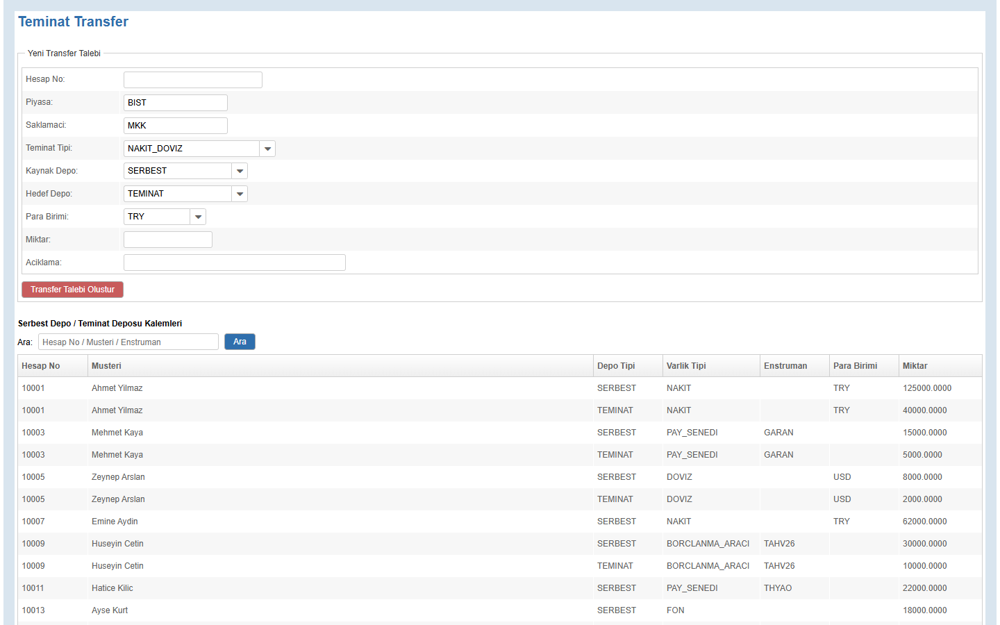
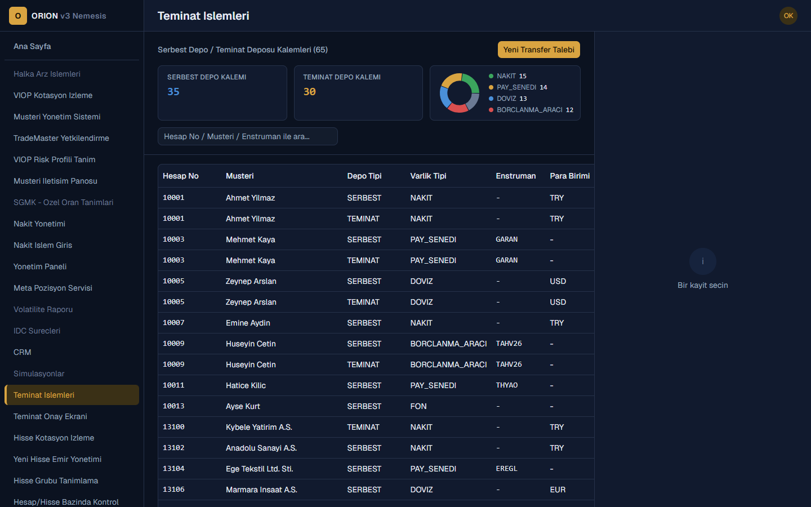

# Orion v3 Nemesis

A from-scratch recreation of a Turkish brokerage back-office platform, built as
a **case study in agentic software development**. The project has two
frontends sharing one backend and one database:

- a **legacy** server-side UI (ZK7 / MVVM), and
- a **new** client-side UI (React), being migrated over screen-by-screen,

plus a custom, reusable **agent skill toolkit** (see [`agent-skills/`](./agent-skills))
that was actually used to design, migrate, and test every screen in this
repository with an AI coding agent ([OpenCode](https://github.com/sst/opencode)).

| Legacy ZK7 screen | New React screen |
|---|---|
|  |  |

## Why this exists

The original UI mockups live in [`design-screenshots/`](./design-screenshots) -
four screenshots of a real-world brokerage back-office tool. Everything else
(schema, backend, both frontends, the test suite, and the agent skills used to
build all of it) was derived from and built around that reference. It exists to
explore, end-to-end, how far an AI agent can take a legacy-to-modern UI
migration - with correct business logic, a real database, and automated
regression tests - when guided by well-scoped, reusable "skills" instead of
one-off ad-hoc prompting.

## Architecture

```
                     ┌─────────────────────┐
                     │   MSSQL 2022         │
                     │   (Docker, Flyway)   │
                     └──────────▲───────────┘
                                │ JPA / Hibernate
                     ┌──────────┴───────────┐
                     │  Spring Boot 2.7.18   │
                     │  (Java 17)            │
                     │                       │
                     │  ZK7 ViewModels  ─────┼──► legacy screens (.zul)
                     │  REST + DTO layer─────┼──► JSON API (/api/v1/**)
                     └──────────┬────────────┘
                                │ HTTP (axios)
                     ┌──────────┴───────────┐
                     │  React 19 + Vite      │
                     │  (nemesis-frontend)   │
                     └───────────────────────┘
```

Both UIs call into the **same** service layer and the **same** tables - a
screen migrated to React does not get a parallel data model, it gets a REST
controller + DTO/mapper in front of the existing service, so the legacy ZK
screen and the new React page always stay consistent.

### Backend

| Component | Version |
|---|---|
| Java | 17 |
| Spring Boot | 2.7.18 (`spring-boot-starter-web`, `-data-jpa`, `-tomcat`, `-validation`) |
| ZK (Community Edition) | 7.0.3 |
| Database | MS SQL Server 2022 (Docker) |
| Migrations | Flyway (30 versioned migrations, `V1` &rarr; `V30`) |
| DTO mapping | MapStruct 1.5.5 |
| Boilerplate | Lombok 1.18 |
| Excel export | Apache POI 5.2.5 |

### Frontend (`nemesis-frontend/`)

| Component | Version |
|---|---|
| React | 19 |
| Build tool | Vite 8 |
| Language | TypeScript ~6.0 |
| Data fetching | TanStack Query 5 |
| Routing | React Router 7 |
| Styling | Tailwind CSS 4 |
| Components | shadcn + @base-ui/react |
| HTTP client | Axios |
| Notifications | Sonner |
| Charts | Recharts |

### Testing (`test-automation/`)

A self-contained, **permanent** end-to-end regression suite (not a one-off
script folder) built with `puppeteer-core` - it drives the already-installed
Edge browser, so no separate Chromium download is required. See
[Testing](#testing) below.

## Module coverage

Out of 38 modules in the original side menu, **19 have been migrated to
React** so far; the rest still render as a "coming soon" placeholder in the
new frontend and remain available in the legacy ZK app in the meantime.

<details>
<summary>Migrated to React (19)</summary>

VIOP Quote Monitoring &middot; Customer Management &middot; TradeMaster
Authorization &middot; VIOP Risk Profile Definition &middot; Customer
Communication Board &middot; Cash Management &middot; Cash Transaction Entry
&middot; Admin Panel &middot; Meta Position Service &middot; CRM &middot;
Collateral Transactions &middot; Collateral Approval Screen &middot; Stock
Quote Monitoring &middot; New Stock Order Management &middot; Stock Group
Definition &middot; Account/Stock-Level Control &middot; Market Data
Management &middot; Credit Transactions &middot; Report Management

</details>

<details>
<summary>Still legacy-only / placeholder in React (19)</summary>

IPO Transactions &middot; CSD Special Rate Definitions &middot; Volatility
Report &middot; IDC Processes &middot; Simulations &middot; Account Suspension
Rules &middot; Smart Order &middot; Reports &middot; International OMS &middot;
Institutional Portfolio Transactions &middot; NOMX &middot; Stock Repo &middot;
Institutional FIFO Reconciliation &middot; Colocation Circuit Breaker &middot;
Research &middot; Regulatory Reporting &middot; Eurobond Repo &middot; OTC
&middot; (and 1 more)

</details>

## Getting started

### Prerequisites

- **Java 17** (tested with Eclipse Temurin 17)
- **Maven 3.9+**
- **Node.js 20+** and npm (tested with Node 24 / npm 11)
- **Docker Desktop** (for the MSSQL container)
- **Git**

### 1. Clone the repository

```bash
git clone https://github.com/mufasa-349/Orion-V3-Nemesis.git
cd Orion-V3-Nemesis
```

### 2. Start the database

```bash
docker compose up -d
```

This starts an MS SQL Server 2022 container (`orion-mssql`) on
`localhost:1433` with user `sa` / password `Orion_2026_Str0ng!` (a throwaway
local-dev credential, see `docker-compose.yml`).

### 3. Create the `orion` database

Flyway manages the tables inside the database but does not create the
database itself, so this one-time step is manual:

```sql
CREATE DATABASE orion;
```

Run it with `sqlcmd`, Azure Data Studio, SSMS, or any SQL client pointed at
the container above.

### 4. Run the backend

```bash
mvn spring-boot:run
```

On first run, Flyway applies all 30 migrations under
`src/main/resources/db/migration` (schema + seed data) automatically. The
backend listens on `http://localhost:8080`.

- Legacy ZK7 app: [http://localhost:8080/index.zul](http://localhost:8080/index.zul)
- REST API base: `http://localhost:8080/api/v1/**`

### 5. Run the new React frontend

```bash
cd nemesis-frontend
npm install
npm run dev
```

Opens on [http://localhost:5173](http://localhost:5173) and talks to the same
backend REST API.

## Project structure

```
src/main/java/com/orion/       Backend source, one package per module
  <module>/
    domain/        JPA entities
    repository/    Spring Data repositories
    service/       Business logic (shared by ZK and REST)
    vm/            ZK ViewModels (legacy UI)
    controller/    REST controllers (new UI)
    dto/           DTOs + MapStruct mappers
src/main/webapp/                Legacy ZK7 .zul pages, one folder per module
src/main/resources/db/migration/  Flyway SQL migrations (V1-V30)
db/                              Human-readable copy of the schema + a full
                                  reference README (ER diagrams, seed data notes)
nemesis-frontend/                React + Vite + TypeScript frontend
  src/pages/<module>/            One page per migrated module
  src/api/                       Typed REST client functions
  src/nav/menu-registry.ts       Source of truth for the side menu +
                                  migration status per module
test-automation/                 Permanent Puppeteer-core E2E regression suite
  helpers/                       Shared browser/DB/report utilities
  screens/zk/, screens/react/    One script per tested scenario
  reports/                       Generated HTML run reports (kept, not deleted)
agent-skills/                    Example copies of the OpenCode agent skills
                                  used to build this project (see its own README)
design-screenshots/              Original UI screenshots this project is based on
plan.md                          Module-by-module analysis and phased rollout plan
sunum/                           A short slide deck summarizing the project/tooling
```

## Testing

`test-automation/` is a permanent, growing regression suite - not disposable
scratch scripts. Each scenario:

1. Drives the browser (ZK or React) using visible text / DOM order (never
   auto-generated element IDs, which are unstable across both frontends).
2. Verifies the result directly against MSSQL with `sqlcmd`.
3. Cross-checks related screens where relevant (e.g. a request created in one
   screen appears in its approval screen).
4. Cleans up any test data it created.
5. Produces a themed, self-contained HTML report with step-by-step
   screenshots, the SQL query/result, and - on failure - an automatically
   captured console/network diagnostic plus a suggested root cause.

Run any scenario with:

```bash
cd test-automation
npm install   # first time only
node screens/zk/teminat-transfer-olusturma.cjs
node screens/react/teminat-islemleri-yeni-transfer.cjs
```

## Further documentation

- [`plan.md`](./plan.md) - the original module-by-module analysis derived from
  the design screenshots, and the phased rollout strategy.
- [`db/README.md`](./db/README.md) - full database reference: every migration,
  ER relationships per module, and seed data notes.
- [`agent-skills/README.md`](./agent-skills/README.md) - the agent skills used
  to build this project, and what each one does.

## Disclaimer

This is an independent, fictional recreation built for learning and tooling
experimentation. It is not affiliated with, endorsed by, or built using any
proprietary source code from any real brokerage platform.
