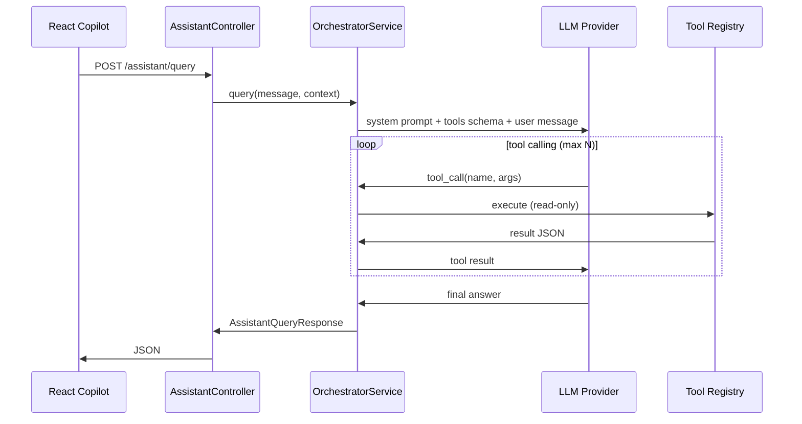

# Orion v3 Nemesis — AI Entegrasyon Fikirleri

> Son güncelleme: 2026-08-11  
> Amaç: Projeye AI'ın nerede, nasıl eklenebileceğini tek yerde toplamak.  
> Aktif planlama: **Bölüm 2 — Operasyon Asistanı (sidebar copilot)**

---

## Bölüm 1 — Fikir envanteri

### 1.1 Ürün içi (kullanıcıya dönük) — en yüksek değer

| ID | Fikir | Kısa açıklama | Risk | Öncelik |
|----|-------|---------------|------|---------|
| **A** | **Operasyon asistanı (sidebar copilot)** | React shell'de sabit panel; doğal dilde soru → LLM + tool calling ile mevcut REST/read-only sorgu | Orta (LLM maliyeti, yanlış cevap) | **P0 — aktif plan** |
| B | Onay ekranı özeti | Teminat/Nakit onay satırına tıklayınca AI kısa özet (geçmiş, limit, risk profili) | Düşük | P1 |
| C | Doğal dil → filtre/sorgu | "Geçen hafta reddedilen VIOP transferleri" → grid filtresi / API param | Orta | P1 |
| D | CRM mesaj taslağı | Kampanya + hedef kitleye göre SMS/e-posta taslağı; insan onayı zorunlu | Düşük | P2 |
| E | Regülasyon / audit açıklaması | `audit_log` + işlem kaydından "bu işlem neden yapıldı?" özeti | Düşük | P2 |

#### A — Operasyon asistanı (özet)

- **UI:** `AppShell` sağında daraltılabilir drawer/panel
- **Backend:** `POST /api/v1/assistant/query` → LLM orchestrator + tool registry
- **Güvenlik:** Sadece okuma; yazma işlemleri LLM'den değil, mevcut onaylı UI butonlarından
- **Detaylı plan:** Bölüm 2

---

### 1.2 Geliştirme zamanı (agent skill'ler)

Mevcut skill'ler (`~/.cursor/skills/`):

| Skill | Rol |
|-------|-----|
| `orion-screen-migration` | ZK7 → React ekran taşıma pipeline'ı |
| `test-automation` | Puppeteer E2E + sqlcmd DB doğrulama |
| `session-memory` | Oturumlar arası proje hafızası |
| `skill-writing` | Yeni skill üretimi |

Önerilen yeni / geliştirilebilir skill'ler:

| Skill | Ne yapar | Tetikleyici örnekleri |
|-------|----------|----------------------|
| `orion-api-parity-check` | ZK ViewModel `@Command` vs REST endpoint karşılaştırması | "API parity kontrol", "REST eksik mi" |
| `orion-flyway-guard` | Çift migration klasörü, V numarası, `db/README.md` zorunluluğu | "yeni migration", "tablo ekle" |
| `orion-regression-suite` | Değişen modüle göre `test-automation/screens/` senaryolarını çalıştırır | "regresyon çalıştır", "collateral test et" |
| `orion-domain-explainer` | `db/README.md` + entity + service'den akış açıklaması | "teminat akışı nasıl", "collateral tabloları" |
| `orion-bug-triage` | FAIL test raporu + log → kök neden + fix önerisi | test FAIL sonrası |
| `orion-react-placeholder-scaffold` | Migrate edilmemiş modül için iskelet page + menu-registry | "placeholder'dan başla" |

**test-automation geliştirmeleri:**

- Modül bazlı checklist şablonları (teminat, nakit, CRM)
- ZK ↔ React parity testi (aynı işlem → aynı DB satırı)
- CI headless runner (`npm run test:e2e -- --module=collateral`)

---

### 1.3 CI / kalite hattı

PR açıldığında agent veya GitHub Action:

1. Değişen Java/TS paketlerini tespit et (`com.orion.collateral.*` vb.)
2. İlgili E2E senaryolarını çalıştır
3. Flyway dosyası varsa çift-kopya kontrolü
4. `mvn -q compile` + `npm run build`
5. PR yorumuna PASS/FAIL + screenshot linki

---

### 1.4 Mimari prensipler (tüm AI özellikleri için)

1. **Tool calling > ham SQL:** LLM doğrudan SQL yazmasın; mevcut `@Service` / REST metodlarını çağırsın.
2. **Read-first:** İlk fazda tüm AI özellikleri salt okunur; mutasyon sadece UI onaylı aksiyonlarla.
3. **Context injection:** Hangi ekran (`pathname`), seçili satır ID'si, aktif kullanıcı rolü prompt'a girsin.
4. **Türkçe domain dili:** Validasyon mesajları ve durum kodları (`BEKLEMEDE`, `ONAYLANDI`) aynen korunsun.
5. **Citation:** Cevapta hangi API/tool kullanıldığı kullanıcıya gösterilsin (güven + debug).

---

## Bölüm 2 — Operasyon Asistanı: Detaylı Plan

### 2.1 Problem tanımı

Back-office operatörleri sık sık:

- "Bu hesapta bekleyen teminat talebi var mı?"
- "12345 nolu transferi neden reddedemiyorum?"
- "Bugün onay bekleyen kaç nakit işlem var?"

gibi sorular sorar. Cevaplar zaten sistemde (REST + DB) var; operatör menüler arasında gezinip filtre uygulamak zorunda kalıyor.

**Hedef:** React shell'de her ekrandan erişilebilen bir copilot; doğal dil → güvenli read-only tool çağrıları → Türkçe, kaynak gösteren cevap.

**Non-hedef (v1):**

- LLM üzerinden onay/red/transfer oluşturma
- Ham SQL çalıştırma
- ZK7 ekranlarında copilot (sadece React/Nemesis)

---

### 2.2 Kullanıcı deneyimi

```
┌──────────┬─────────────────────────────────────┬─────────────┐
│ Sidebar  │  TopBar                             │  Copilot    │
│          ├─────────────────────────────────────┤  (drawer)   │
│          │                                     │             │
│          │  Sayfa içeriği (3 kolon layout)     │  Sohbet     │
│          │                                     │  + öneriler │
│          │                                     │             │
└──────────┴─────────────────────────────────────┴─────────────┘
```

**Davranış:**

- Sağ kenarda **daraltılabilir panel** (varsayılan kapalı; TopBar'da ikon ile açılır)
- Sohbet geçmişi oturum boyunca kalır (localStorage; backend'e log opsiyonel)
- Her mesajda frontend şu **context**'i gönderir:
  - `pathname` (örn. `/collateral/onay`)
  - `pageTitle` (TopBar'dan)
  - `selectedEntityId` / `selectedEntityType` (sayfa sağladığında — örn. seçili transfer id)
- Cevap altında **Kaynaklar** bölümü: hangi tool/API çağrıldı, kaç kayıt döndü
- **Önerilen sorular** (context'e göre):
  - Teminat Onay ekranında: "Bekleyen transfer sayısı?", "Seçili talebin durumu?"
  - Görev listesinde: "Üzerimdeki açık görevler?"

**Tasarım:** Mevcut dark-theme design system (`orion-screen-migration/references/design-system.md`) — panel arka planı `bg-card`, ince border, monospace tool citation.

---

### 2.3 Backend mimarisi

Yeni paket: `com.orion.assistant`

```
com.orion.assistant/
  controller/   AssistantController
  service/      AssistantOrchestratorService
  tool/         AssistantTool (interface)
                CollateralTools, CashTools, WorkflowTools, AccountTools
  dto/          AssistantQueryRequest, AssistantQueryResponse, ToolCallRecord
  config/       AssistantProperties (api key, model, enabled flag)
```

#### API sözleşmesi

**`POST /api/v1/assistant/query`**

Request:

```json
{
  "message": "12345 nolu transferi neden reddedemiyorum?",
  "context": {
    "pathname": "/collateral/onay",
    "pageTitle": "Teminat Onay Ekrani",
    "selectedEntityType": "collateral_transfer",
    "selectedEntityId": 12345
  },
  "conversationId": "uuid-optional"
}
```

Response:

```json
{
  "answer": "12345 nolu transfer BEKLEMEDE durumunda...",
  "toolCalls": [
    {
      "tool": "getCollateralTransferById",
      "input": { "id": 12345 },
      "recordCount": 1
    }
  ],
  "suggestedFollowUps": [
    "Bu hesabın diğer bekleyen talepleri neler?"
  ]
}
```

**`GET /api/v1/assistant/health`** — LLM yapılandırması var mı, assistant aktif mi

#### Orchestrator akışı



**System prompt özleri:**

- Orion back-office asistanısın; sadece tool sonuçlarına dayanarak cevap ver
- Bilmediğin / tool'da olmayan bilgiyi uydurma
- Türkçe, operasyon dili
- Yazma/onay/red işlemi yapamazsın; kullanıcıyı ilgili ekrandaki butona yönlendir
- Domain durumları: `BEKLEMEDE`, `ONAYLANDI`, `REDDEDILDI`, `TAMAMLANDI`, `IPTAL` vb.

---

### 2.4 Tool registry (v1 — read-only)

LLM'in çağırabileceği tool'lar **mevcut service katmanını** sarar; yeni iş mantığı yazılmaz.

| Tool adı | Service / kaynak | Örnek kullanım |
|----------|-------------------|----------------|
| `listCollateralTransfers` | `CollateralService.getTransfersByDurum` / `getAllTransfers` | Bekleyen teminat talepleri |
| `getCollateralTransferById` | `transferRepository.findById` + mapper | Tek transfer detayı |
| `listCollateralHoldings` | `CollateralService.getAllCollaterals` / `searchCollaterals` | Depo kalemleri |
| `listCashTransactionRequests` | `CashTransactionService` | Nakit talepleri |
| `getCashTransactionRequestById` | id ile detay | Nakit talep durumu |
| `listWorkflowTasksOpen` | `WorkflowTaskService.getAcikGorevler` | Açık görevler |
| `getAccountByHesapNo` | `AccountRepository.findByHesapNo` | Hesap özeti |
| `getCustomerById` | `CustomerService` | Müşteri bilgisi |
| `explainTransferStatusRules` | Statik domain bilgisi (prompt/tool description) | "Neden reddedemiyorum?" |

**v1'de olmayan (bilinçli):**

- `approveTransfer`, `createTransfer`, `cancelTransfer` — mutasyon yok
- Generic `runSql` — güvenlik riski

Tool description'larında domain kuralları açık yazılır:

> `onayla` sadece `BEKLEMEDE` durumundaki transferlerde çalışır. Mevcut durum farklıysa service `IllegalStateException` fırlatır.

---

### 2.5 Güvenlik modeli

| Katman | v1 (demo) | v2 (prod) |
|--------|-----------|-----------|
| Kimlik | Sabit kullanıcı (mevcut JWT TODO ile uyumlu) | JWT → user id + roller |
| Yetki | Tüm read tool'lar açık | Rol bazlı tool allowlist (örn. CRM operatörü kredi detayı görmez) |
| Mutasyon | Tool registry'de yok | Hâlâ yok; sadece UI |
| Rate limit | Basit IP/session limit | Redis tabanlı |
| Audit | Opsiyonel `assistant_query_log` tablosu | Zorunlu |
| API key | `application.yml` / env `ORION_ASSISTANT_API_KEY` | Secret manager |
| PII | Cevapta TCKN maskeleme kuralı | KVKK uyumlu redaction |

**Kritik kural:** LLM çıktısı asla doğrudan DB'ye yazılmaz. Kullanıcı "onayla" dese bile asistan: "Teminat Onay ekranındaki Onayla butonunu kullanın" der.

---

### 2.6 Frontend değişiklikleri

| Dosya | Değişiklik |
|-------|------------|
| `components/shell/AppShell.tsx` | Copilot drawer layout (flex + resizable veya sabit genişlik ~360px) |
| `components/shell/TopBar.tsx` | Copilot aç/kapa ikonu |
| `components/assistant/AssistantPanel.tsx` | **yeni** — sohbet UI |
| `components/assistant/AssistantMessage.tsx` | **yeni** — mesaj + tool citation |
| `hooks/useAssistantContext.ts` | **yeni** — pathname, title, selection |
| `api/assistant.ts` | **yeni** — `postQuery()` |
| Sayfa bileşenleri (opsiyonel v1) | Seçili satırı context'e vermek için `useAssistantContext` setter |

**Context iletimi:** React Context veya Zustand store — sayfalar `setAssistantSelection({ type, id })` çağırır.

---

### 2.7 LLM sağlayıcı seçimi

| Seçenek | Artı | Eksi |
|---------|------|------|
| OpenAI API (GPT-4o-mini) | Tool calling olgun, hızlı entegrasyon | Dış servis, maliyet |
| Anthropic API | Uzun context, iyi Türkçe | Dış servis |
| Ollama (lokal) | Veri dışarı çıkmaz | Tool calling kalitesi değişken, Mac'te yavaş |
| Spring AI (abstraction) | Sağlayıcı değiştirilebilir | Ek dependency |

**Öneri (bu proje için):** Spring AI + OpenAI/Anthropic; `assistant.enabled=false` ile CI/dev'de kapalı.

`pom.xml` (plan):

```xml
<!-- spring-ai-openai veya spring-ai-anthropic -->
```

`application.yml`:

```yaml
orion:
  assistant:
    enabled: true
    provider: openai
    model: gpt-4o-mini
    max-tool-rounds: 5
    api-key: ${ORION_ASSISTANT_API_KEY:}
```

---

### 2.8 Fazlama

#### Faz 0 — İskelet (1–2 gün)

- [ ] `AssistantController` + mock cevap (LLM yok, sabit JSON)
- [ ] `AssistantPanel` UI, AppShell entegrasyonu
- [ ] `api/assistant.ts` + loading/error durumları

**DoD:** Panel açılır, mock cevap gelir, context pathname backend'e ulaşır.

#### Faz 1 — Tool calling, teminat odaklı (3–5 gün)

- [ ] `CollateralTools` (list/get + status rules)
- [ ] `AssistantOrchestratorService` + Spring AI
- [ ] System prompt + tool schema
- [ ] Teminat Onay + Teminat İşlemleri sayfalarında selection context

**DoD:** "Bekleyen teminat transferleri?" ve "12345 nolu transfer durumu?" doğru cevaplanır; tool citation görünür.

#### Faz 2 — Nakit + workflow genişletme (2–3 gün)

- [ ] `CashTools`, `WorkflowTools`
- [ ] Context'e göre suggested questions
- [ ] `assistant_query_log` (opsiyonel Flyway migration)

#### Faz 3 — Sertleştirme (2–3 gün)

- [ ] JWT entegrasyonu hazır olduğunda rol filtresi
- [ ] Rate limit
- [ ] E2E test: copilot aç → soru sor → cevap + HTTP 200
- [ ] `test-automation/screens/react/assistant-teminat-sorgu.cjs`

---

### 2.9 Test stratejisi

**Manuel:**

- Teminat Onay'da BEKLEMEDE kayıt seç → "Bu talebi neden onaylayamıyorum?" (yanlış durum senaryosu)
- Var olmayan ID → "Transfer bulunamadı" tarzı cevap

**Otomasyon (`test-automation`):**

1. Copilot panelini aç (TopBar ikon)
2. Input'a sabit soru yaz, gönder
3. Cevap metninde beklenen anahtar kelime (`BEKLEMEDE`, hesap no vb.)
4. Network: `POST /api/v1/assistant/query` 200
5. DB: read-only — veri değişmemeli (assert count before/after)

**Backend unit:**

- Tool'lar mock service ile izole test
- Orchestrator: LLM mock → tool call parse → sonuç birleştirme

---

### 2.10 Kararlar (uygulandi — 2026-08-11)

1. **Panel konumu:** Sağ drawer (360px), TopBar'da "Danisman" butonu
2. **Streaming:** v1 non-streaming JSON
3. **Conversation persistence:** `localStorage` (`orion-assistant-chat-v1`)
4. **LLM sağlayıcı:** Google Gemini (`gemini-2.0-flash`), env: `ORION_GEMINI_API_KEY`
5. **Mock mode:** API key yoksa veya Gemini hata verirse keyword + read-only tool fallback
6. **Mod:** Salt danışman — kayıt oluşturma/güncelleme/silme yok; adım adım rehberlik

**Kurulum:**

```bash
export ORION_GEMINI_API_KEY="your-key-from-aistudio.google.com"
# Backend restart
```

Key olmadan da mock modda calisir (ornek: "Kullanici yetkisini nasil duzenlerim?").

---

### 2.11 İlgili dosyalar (referans)

| Alan | Path |
|------|------|
| React shell | `nemesis-frontend/src/components/shell/AppShell.tsx` |
| Teminat REST | `src/main/java/com/orion/collateral/controller/CollateralTransferController.java` |
| Teminat iş mantığı | `src/main/java/com/orion/collateral/service/CollateralService.java` |
| API client | `nemesis-frontend/src/api/client.ts` |
| DB referans | `db/README.md` |
| E2E DB helper | `test-automation/helpers/db.js` |
| Screen migration skill | `agent-skills/orion-screen-migration/` |

---

## Bölüm 3 — Sonraki adımlar

1. **Faz 0'ı uygula** — mock backend + UI iskeleti (LLM/API key gerekmez)
2. LLM sağlayıcı ve API key kararını netleştir
3. Faz 1 tool listesini teminat modülüyle sınırla; ilk demo senaryolarını yaz
4. İsteğe bağlı: `orion-domain-explainer` skill'ini assistant system prompt'unu beslemek için kullan
